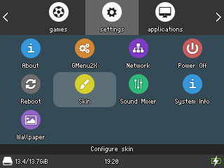
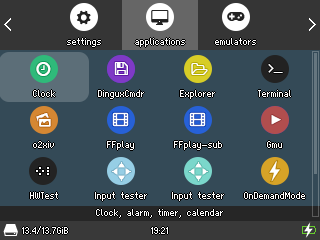

# SARSskin-RG350
A clean skin for the handheld console RG350

  

# Installation
Download and unzip.
Copy the SARSskin-RG350 folder /media/data/local/home/.gmenu2x/skins

# Credits
Icons made from different fonts: Font Awesome, Entypo, Iconic, and Elusive (all SIL Open Font License)
